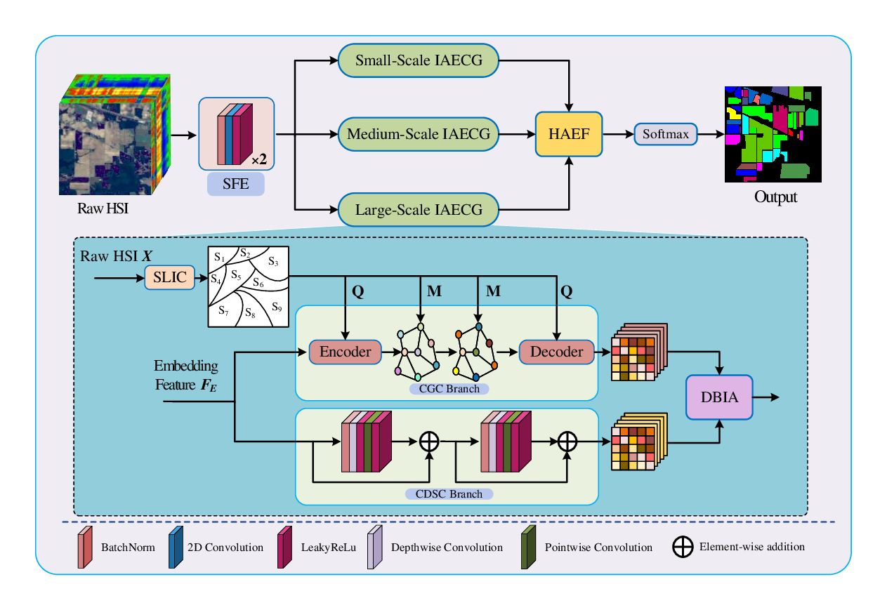

# 📖 MIAF-Net: Multiscale Interactive Attention Fusion Network for Hyperspectral Image Classification (ESWA 2025)

Demo code of ["MIAF-Net: Multiscale Interactive Attention Fusion Network for Hyperspectral Image Classification"](https://www.sciencedirect.com/science/article/abs/pii/S0957417425020056)

- Authors: Jinliang An, Longlong Dai, Weidong Zhang and Xiangrong Zhang

### 🧩 Overall
<div align=center>

</div>

### 🌱 Abstract
>In recent years, convolutional neural networks (CNNs) have been widely used for hyperspectral image (HSI) classification due to their ability to learn features automatically. However, CNNs are limited by fixed convolutional kernels and are challenging to apply to non-Euclidean data. Although graph convolutional networks (GCNs) can extract global topological information by modeling HSI data as graph structures through superpixel segmentation, this process often leads to the loss of pixel-level details. To fully combine the advantages of CNN and GCN, we propose a multiscale interactive attention fusion network (MIAF-Net), which includes three core modules: the interactive attention enhanced CNN-GCN module (IAECG), the dual branch interactive attention module (DBIA), and the hierarchical attention enhanced fusion module (HAEF). Specifically, the IAECG consists of a CNN branch for local spatial feature extraction and a GCN branch for global topological information capture. To facilitate effective information exchange between these branches, we design the DBIA module, which employs an interactive attention mechanism to enhance heterogeneous feature interaction. In addition, the network employs a multiscale strategy with varied convolutional kernel sizes in the CNN branch and superpixel segmentation scales in the GCN branch to enhance feature modeling capability. Furthermore, the HAEF module achieves an adaptive fusion of inter-scale and intra-scale information through a hierarchical attention mechanism, further enhancing the classification performance of the network. Notably, by integrating both CNN and GCN in a unified framework, MIAF-Net enables scene-level modeling of the entire HSI, avoiding the contextual information loss commonly associated with traditional patch-based approaches. Extensive experiments on four benchmark HSI datasets demonstrate that the proposed method outperforms state-of-the-art methods.

### 📃 Requirements
>* Python == 3.8.19
>* pytorch == 2.4.0

### 🥰 Citation	

**Please kindly cite the papers if this code is useful and helpful for your research.**
```
@article{AN2025128386,
title = {MIAF-Net: Multiscale interactive attention fusion network for hyperspectral image classification},
journal = {Expert Systems with Applications},
volume = {290},
pages = {128386},
year = {2025},
issn = {0957-4174},
author = {Jinliang An and Longlong Dai and Weidong Zhang and Xiangrong Zhang}
}
```
